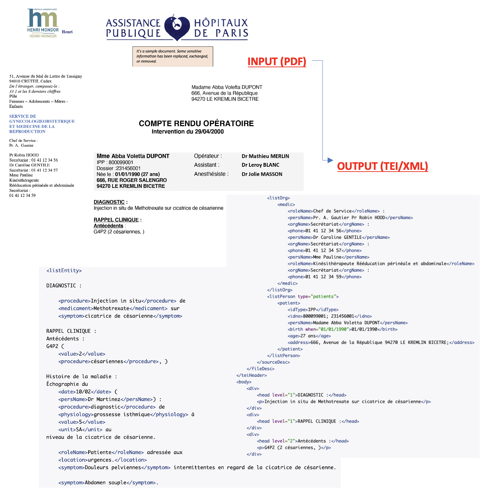
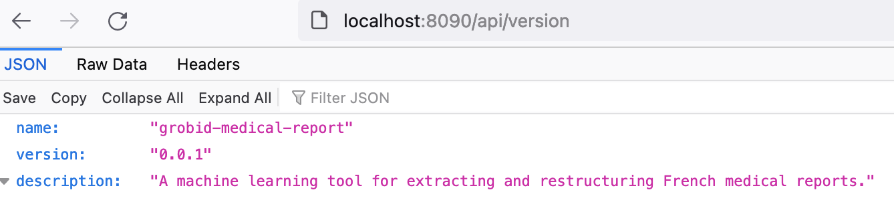

# grobid-medical-report :hospital:
grobid-medical-report is a [GROBID](https://github.com/kermitt2/grobid) module for extracting and restructuring medical reports from raw documents (PDF, text) into encoded documents (XML/TEI). All models built in this module are machine learning models that implement Wapiti CRF as Grobid's default models (it's possible to use deep learning models developed with [DeLFT](https://github.com/kermitt2/delft/) in Grobid as an alternative to the Wapiti CRF).



## Clone and install GROBID
**grobid-medical-report** is a module of GROBID and therefore the installation of GROBID is required.

### Clone GROBID
First, clone the latest version of GROBID. We can clone the forked project or the original [GROBID](https://github.com/kermitt2/grobid.git) repository (with slight adjustments to use **grobid-medical-report** module).

1. Clone from the forked project:

```
$ git clone https://github.com/tantikristanti/grobid.git
```

- Change directory (cd) to GROBID path

```
$ cd grobid
```

- Switch to *grobid-medical-report* branch

```
$ git checkout grobid-medical-report
```

** OR **
2. Clone from the original GROBID repository: 

```
$ git https://github.com/kermitt2/grobid.git
```

- Change directory (cd) to GROBID path

```
$ cd grobid
```

- In order not to interfere existing branches, it is recommended to create and switch to a new branch.
```
$ git checkout -b [NEW_BRANCH]
```
* Slight adjustments
  1. Registration of the new model names in the GrobidModels class (grobid-core/src/main/java/org/grobid/core/GrobidModels.java).
  2. Configuration of **grobid-medical-report** models in the grobid.yaml (grobid-home/config/grobid.yaml) by specifying:
      - Model names
      - Engine (machine learning with [Wapiti](https://wapiti.limsi.fr/) or deep learning with [Delft](https://github.com/kermitt2/delft/))
      - Training parameters
  3. Activation of the **-readingOrder** option to read the document block according to the reading order.
  
### Install GROBID
Install and build GROBID: 

```
$ ./gradlew clean install
```

To install and build GROBID under the proxy, we need to add the proxy host and port:
```
$  ./gradlew -DproxySet=true -DproxyHost=[proxy_host] -DproxyPort=[proxy_port] clean install
```

## Clone and install *grobid-medical-report*

Make sure that the current working directory is `grobid`:
```
$ pwd
    --> grobid
```

### Clone *grobid-medical-report*

Clone **grobid-medical-report** from this repository:
```
$ git clone https://github.com/tantikristanti/grobid-medical-report.git
```

- Change directory (cd) to **grobid-medical-report** path

```
$ cd grobid-medical-report
$ pwd
    --> grobid/grobid-medical-report
```

### Install *grobid-medical-report*
Install and build **grobid-medical-report**:

```
$ ./gradlew clean install
```

To install and build **grobid-medical-report** under the proxy, we need to add the proxy host and port:
```
$  ./gradlew -DproxySet=true -DproxyHost=[proxy_host] -DproxyPort=[proxy_port] clean install
```

## Models
Following [GROBID](https://grobid.readthedocs.io/en/latest/Principles/#document-parsing-as-a-cascade-of-sequence-labeling-models), __grobid-medical-report__ also builds models with a waterfall (cascade) approach. We prepare 11 sequence labeling models to parse medical documents in different hierarchical structures of the document. 


Using these models, we can extract medical documents, in this case in French, with the following steps:
1. Firstly,  we use the `medical-report-segmenter` model to segment the input document (PDF) into the header, the body, notes (headnote, footnote, left-note, right-note), and page sections.
2. Then, from the results at the segmentation stage, we extract information on each part by using the appropriate model. For example, we use a `header-medical-report` model for extracting information concerning patients, medical personnel, and documents (e.g., document number, document type, and date) found in the header section.
3. Information gathered from each section is aggregated using the `full-medical-text` model.
4. In addition to the models for parsing and restructuring, we also provide the `French-medical-NER` model for recognizing medical terminologies found mainly in body parts.

Each of these models can be retrained by using additional data. A more detailed explanation of how to retrain and to evaluate the models can be found in [Train and evaluate the models](doc/Training-the-medical-report-models.md)

## API Services 
### Web-based application
A web-based front-end is provided for end-users to be able to use a number of methods and models in an attractive way, in addition to batch commands. To run the service, run the following command:

```
$ ./gradlew run
```

Service can be accessed via port 8090 (http://localhost:8090/).


1. To check whether the service is up:
```
    http://localhost:8090/api/isalive
    >>> The service will return whether the service is up (true) or not (false)
```

2. To get the service version and description:
```
    http://localhost:8090/api/version 
    http://localhost:8090/api/grobidMedicalReport     
```


### API RESTful
More detailed explanations concerning API services provided by grobid-medical-report can be accessed here [API services](doc/API_service.md)

## Copyright
This repository was originally prepared for a collaborative project between [INRIA](https://www.inria.fr/) and  [APHP](https://www.aphp.fr/). Original datasets and models containing genuine sensitive data are not possible to share publicly. 
