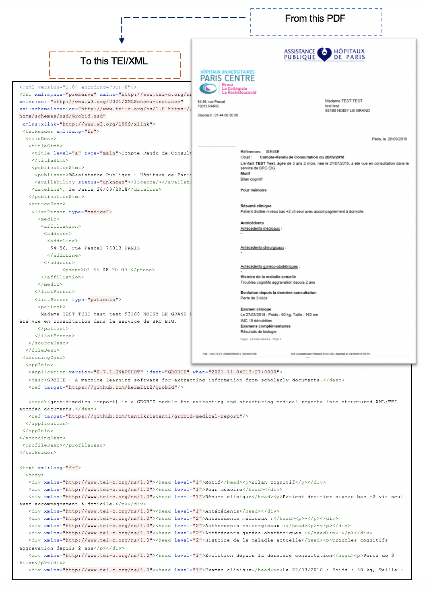

# grobid-medical-report :hospital:
grobid-medical-report is a [GROBID](https://github.com/kermitt2/grobid) module for extracting and restructuring medical reports from raw documents (PDF, text) into encoded documents (XML/TEI). All models built in this module are machine learning models that implement Wapiti CRF as Grobid's default models (it's possible to use deep learning models developed with [DeLFT](https://github.com/kermitt2/delft/) in Grobid as an alternative to the Wapiti CRF).



## Install - Build - Run

First install the latest development version of GROBID as explained by the [documentation](http://grobid.readthedocs.org).

It is recommended to create a new branch to work specifically with the grobid-medical-report module as some adaptations are required.

### Slight adjustments on the Grobid side
grobid-medical-report is a module of Grobid that is intentionally separated from Grobid as this tool is specifically intended for APHP medical document extraction projects that handle sensitive data. Neither the training data nor the built models are shared publicly (only the program codes are accessible).

To be able to use this tool, the installation of Grobid is a must. In addition, after installing Grobid, there are some adjustments on the Grobid side:
1. Registration of the new model names in the GrobidModels class (grobid-core/src/main/java/org/grobid/core/GrobidModels.java). For examples:
   ```
    MEDICAL_REPORT_SEGMENTER("medical-report-segmenter"),
    HEADER_MEDICAL_REPORT("header-medical-report"),
    LEFT_NOTE_MEDICAL_REPORT("left-note-medical-report"),
    MEDIC("medic"),
    PATIENT("patient"),
    NAMES_PERSON_MEDICAL("name/person-medical"),
    DATELINE("dateline"),
    ORGANIZATION("organization"),
    FULL_MEDICAL_TEXT("full-medical-text"),
    FR_MEDICAL_NER("fr-medical-ner");
   ```
2. Configuration of new models in grobid.yaml (grobid-home/config/grobid.yaml) by specifying:
   - Model names
   - Engine (machine learning with [Wapiti](https://wapiti.limsi.fr/) or deep learning with [Delft](https://github.com/kermitt2/delft/))
   - Training parameters
    
    For examples (cam be copied from `resources/config/grobid-medical-report.yaml`):
     ```
     - name: "medical-report-segmenter"
       engine: "wapiti"
       wapiti:
        # wapiti training parameters
        epsilon: 0.0000001
        window: 50
        nbMaxIterations: 2000
   
   - name: "header-medical-report"
       engine: "wapiti"
       engine: "delft"
       wapiti:
        # wapiti training parameters
        epsilon: 0.000001
        window: 30
        nbMaxIterations: 1500
       delft:
        # deep learning parameters
        architecture: "BidLSTM_CRF_FEATURES"
        runtime:
          # parameters used at runtime/prediction
          max_sequence_length: 3000
          batch_size: 1
     ```
   
3. Activation of the **-readingOrder** option to read the document block according to the reading order.

To apply the changes, Grobid needs to be rebuilt:
> ./gradlew clean install

### Copy the trained models
Put the module grobid-medical-report as a sibling sub-project of GROBID (e.g., grobid-core, grobid-trainer) :
> cp -r grobid-medical-report grobid/

> cd PATH-TO-GROBID/grobid/grobid-medical-report

Copy the existing trained model in the standard `grobid-home` path, type the command under `grobid/grobid-medical-report` path:

> ./gradlew copyModels 

In general, the model will be placed under `PATH-TO-GROBID/grobid/grobid-home/models/`

Try compiling everything with:

> ./gradlew clean install

To build grobid-medical-report under the proxy, the proxy host and port need to be added : 
>  ./gradlew -DproxySet=true -DproxyHost=[proxy_host] -DproxyPort=[proxy_port] clean install

## Start the Service

> ./gradlew appRun

Demo console (Web app) is accessible at ```http://localhost:8080```. Close the application by pressing a button to kill the Java process and not via Ctrl+C. 

Using ```curl``` POST/GET requests:

```
curl -X POST -d "text=Text to be processed." localhost:8080/service/processNameText
```

```
curl -GET --data-urlencode "text=Text to be processed." localhost:8080/service/processNameText
```

## Training and Evaluation


To train and to evaluate the model under the proxy, the proxy host and port need to be added : 
Example : 
```
> cd PATH-TO-GROBID/grobid/grobid-medical-report

> ./gradlew train_medical_report_segmenter -DproxySet=true -DproxyHost=
  [proxy_host] -DproxyPort=[proxy_port]
```

### Training Only

For training the medical-report model with all the available training data:

```
> cd PATH-TO-GROBID/grobid/grobid-medical-report

> ./gradlew train_medical_report_segmenter
```

The training data must be under ```grobid-medical-report/resources/dataset/medical-report-segmenter/corpus```

### Evaluating Only

For evaluating under the labeled data under ```grobid-medical-report/resources/dataset/medical-report-segmenter/evaluation```, use the command:

```
>  ./gradlew eval_medical_report_segmenter
```

### Automatic Corpus Split

To split automatically and randomly the available annotated data (under ```resources/dataset/medical-report-segmenter/corpus/```) into a training set and an evaluation set, we use the following commands:

```
>  ./gradlew eval_medical_report_split
```

It trains the model based on the first data set and launch an evaluation based on the second one. 
By default, 80% of the available data is for training and the remaining for evaluation. The ratio can be changed by editing the corresponding exec profile in the pom.xml file. 


## Generation of New Training Data

To generate new annotated data in TEI format based on the current model : 

```
> java -Xmx4G -jar build/libs/grobid-medical-report-0.0.1-onejar.jar -gH ../grobid-home -dIn ~/path_to_input_directory/ -dOut ~/path_to_output_directory -exe createTraining
```

We need to define the path to the input and output directories.

## Training Data and Models Copyright

This is a collaborative project between [INRIA](https://www.inria.fr/) and  [APHP](https://www.aphp.fr/) where data and models are not possible to share publicly. 
