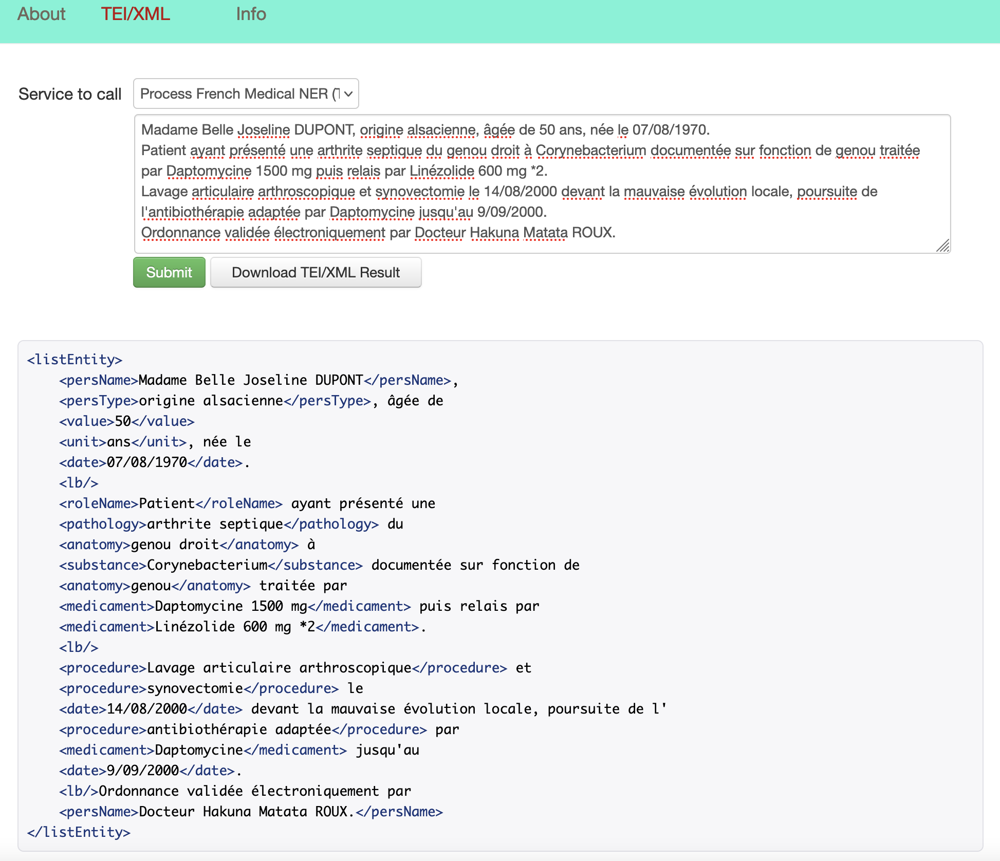

# grobid-medical-report API services

## Raw text to TEI conversion services
The services in this subsection are provided to receive plain text input and send the extraction results in TEI/XML format.

Response status codes are:

| HTTP Status code       | Signification                                                                                                                                                                                      |
|------------------------|----------------------------------------------------------------------------------------------------------------------------------------------------------------------------------------------------|
| 200                    | Successful operation.                                                                                                                                                                              |
| 204                    | Process was completed, but no content could be extracted and structured                                                                                                                            |
| 400                    | Wrong request, missing parameters, missing header                                                                                                                                                  |
| 500                    | Indicate an internal service error, further described by a provided message                                                                                                                        |
| 503                    | The service is not available, which usually means that all the threads are currently used. The client need to re-send the query after a wait time that will allow the server to free some threads. |


### /api/processDateline

Parse a raw dateline string and return the extracted dateline.

| Method	    | Request type 	                    | Response type 		   | Parameters 	 | Requirement  	 | Description				       |
|------------|-----------------------------------|--------------------|--------------|----------------|-----------------------|
| POST, PUT	 | application/x-www-form-urlencoded | application/xml  	 | dateline     | required	      | dateline to be parsed |

For testing the service, we can use the **cURL** command line. For example:

```console
$ curl -X POST -d "dateline=Intervention du 14/03/2017. Paris, le 20.9.2018" localhost:8090/api/processDateline
```

The successful operation will return:

```xml
<dateline>
    <note type="date">Intervention</note> du <date>14/03/2017</date>. <placeName>Paris</placeName>, le <date>20.9.2018</date>
</dateline>
```

### /api/processMedic

Parse a raw patient string and return the extracted patient data.

| Method	    | Request type 	                    | Response type 		   | Parameters 	 | Requirement  	 | Description				       |
|---		|---				  |---					 |--------------|---			|----------------------|
| POST, PUT	| application/x-www-form-urlencoded | application/xml  	| patient      | required	| patient to be parsed |

For testing the service, we can use the **cURL** command line. For example:

```console
$ curl -X POST -d "medic=Chef de Service Pr. Abagael ZOSIMA. Assistant Dr Woody WOOD." localhost:8090/api/processMedic
```

The successful operation will return:

```xml
<medic>
    <roleName>Chef de Service</roleName> <persName>Pr. Abagael ZOSIMA</persName>. <roleName>Assistant</roleName> <persName>Dr Woody WOOD</persName>.
</medic>
```

### /api/processPatient

Parse a raw medic string and return the extracted medical personnel.

| Method	    | Request type 	                    | Response type 		   | Parameters 	 | Requirement  	 | Description				       |
|---		|---				  |---					 |--------------|---			|----------------------|
| POST, PUT	| application/x-www-form-urlencoded | application/xml  	| patient      | required	| patient to be parsed |

For testing the service, we can use the **cURL** command line. For example:

```console
$ curl -X POST -d "patient=Madame Eva GOODRICH 666, RUE DU MARRANT 92290 CHATENAY MALABRY" localhost:8090/api/processPatient
```

The successful operation will return:

```xml
<patient>
    <persName>Madame Eva GOODRICH</persName> <address>666, RUE DU MARRANT 92290 CHATENAY MALABRY</address>
</patient>
```

### /api/processNER

Parse a raw medic string and return the extracted medical personnel.

| Method	    | Request type 	                    | Response type 		   | Parameters 	 | Requirement  	 | Description				       |
|---		|---				  |---					 |--------------|---			|------------------|
| POST, PUT	| application/x-www-form-urlencoded | application/xml  	| ner          | required	| ner to be parsed |

For testing the service, we can use the **cURL** command line. For example:

```console
$ curl -X POST -d "ner=Madame Renee MASSON ayant présenté une arthrite septique du genou droit à Corynebacterium documentée sur fonction de genou traitée par Daptomycine 1500 mg puis relais par Linézolide 600 mg *2" localhost:8090/api/processNER
```

The successful operation will return:

```xml
<listEntity>
    <persName>Madame Renee MASSON</persName> ayant présenté une <pathology>arthrite septique</pathology> du <anatomy>genou droit</anatomy> à <substance>Corynebacterium</substance> documentée sur fonction de <anatomy>genou</anatomy> traitée par <medicament>Daptomycine 1500 mg</medicament> puis relais par <medicament>Linézolide 600 mg *2</medicament>
</listEntity>
```

Results using a web-based application:


## PDF to TEI conversion services
The services in this subsection are provided to receive PDF file input and send the extraction results in TEI/XML format.

Response status codes:

|     HTTP Status code | Signification                                                                                                                                                                                             |
|---                   |----------------------------------------------------------------------------------------------------------------------------------------------------------------------------------------------------|
|         200          | Successful operation.                                                                                                                                                                              |
|         204          | Process was completed, but no content could be extracted and structured                                                                                                                            |
|         400          | Wrong request, missing parameters, missing header                                                                                                                                                  |
|         500          | Indicate an internal service error, further described by a provided message                                                                                                                        |
|         503          | The service is not available, which usually means that all the threads are currently used. The client need to re-send the query after a wait time that will allow the server to free some threads. |


### /api/processHeaderDocument

Extract the header of the input PDF document, normalize it and convert it into a TEI XML format.

| Method	    | Request type 	                    | Response type 		   | Parameters 	 | Requirement  	 | Description				       |
|---        |---                    |---                   |---                  |---            |---            |
| POST, PUT | `multipart/form-data` | `application/xml`    | `input`             | required      | PDF file to be processed |

For testing the service, we can use the **cURL** command line. For example:

```console
$ curl -v --form input=@./Example.pdf localhost:8090/api/processHeaderDocument
```
The successful operation will return:
```
*   Trying 127.0.0.1...
* TCP_NODELAY set
* Connected to localhost (127.0.0.1) port 8090 (#0)
> POST /api/processHeaderDocument HTTP/1.1
> Host: localhost:8090
> User-Agent: curl/7.64.1
> Accept: */*
> Content-Length: 473311
> Content-Type: multipart/form-data; boundary=------------------------cbd8d6dc8d0c9c75
> Expect: 100-continue
> 
< HTTP/1.1 100 Continue
* We are completely uploaded and fine
< HTTP/1.1 200 OK
< Date: Mon, 29 Aug 2022 13:18:12 GMT
< Content-Type: application/xml; charset=UTF-8
< Content-Length: 1978
< 
```
```xml
<?xml version="1.0" encoding="UTF-8"?>
<TEI xml:space="preserve" xmlns="http://www.tei-c.org/ns/1.0" 
xmlns:xsi="http://www.w3.org/2001/XMLSchema-instance" 
xmlns:xlink="http://www.w3.org/1999/xlink">
	<teiHeader xml:lang="fr">
		<encodingDesc>
			<appInfo>
				<application version="0.0.1" name="grobid-medical-report" access="2022-08-29T13:18+0000">
					<desc>grobid-medical-report is a GROBID (https://github.com/kermitt2/grobid) module for extracting and structuring French medical reports into structured XML/TEI encoded documents.</desc>
					<ref target="https://github.com/tantikristanti/grobid-medical-report"/>
				</application>
			</appInfo>
		</encodingDesc>
		<fileDesc>
			<titleStmt>
				<title type="main">COMPTE RENDU OPÉRATOIRE</title>
				<extent>
					<measure unit="pages">1</measure>
				</extent>
			</titleStmt>
				<availability>
					<p>Copyright : ©grobid-medical-report (INRIA-Project)</p>
				</availability>
			<publicationStmt>
				<date type="issued" when="2000-04-29">2000-04-29</date>
				<publisher>
					<affiliation>Pôle Femmes -Adolescents -Mères -Enfants SERVICE DE GYNECOLOGIEOBSTETRIQUE ET MEDECINE DE LA REPRODUCTION</affiliation>
					<address>
						<addrLine>51, Avenue du Mal de Lattre de Tassigny 94010 CRETEIL Cedex</addrLine>
					</address>
				</publisher>
			</publicationStmt>
			<sourceDesc>
				<listPerson type="medics">
					<medic>
						<persName>Dr Mathieu MERLIN; Dr Leroy BLANC; Dr Jolie MASSON</persName>
						<roleName>Opérateur	Assistant	Anesthésiste</roleName>
					</medic>
				</listPerson>
				<listPerson type="patients">
					<patient>
						<idType>IPP</idType>
						<idno>800099001; 231456001</idno>
						<persName>Madame Abba Voletta DUPONT</persName>
						<birth when="01/01/1990">01/01/1990</birth>
						<age>27 ans</age>
						<address>666, Avenue de la République 94270 LE KREMLIN BICETRE;</address>
					</patient>
				</listPerson>
			</sourceDesc>
		</fileDesc>
	</teiHeader>
</TEI>
```
```
* Connection #0 to host localhost left intact
* Closing connection 0
```

### /api/processLeftNoteDocument

Extract the header of the input PDF document, normalize it and convert it into a TEI XML format.

| Method	    | Request type 	                    | Response type 		   | Parameters 	 | Requirement  	 | Description				       |
|---        |---                    |---                   |---                  |---            |---            |
| POST, PUT | `multipart/form-data` | `application/xml`    | `input`             | required      | PDF file to be processed |

For testing the service, we can use the **cURL** command line. For example:

```console
$ curl -v --form input=@./Example.pdf localhost:8090/api/processLeftNoteDocument
```

The successful operation will return:
```
*   Trying 127.0.0.1...
    * TCP_NODELAY set
    * Connected to localhost (127.0.0.1) port 8090 (#0)
    > POST /api/processLeftNoteDocument HTTP/1.1
    > Host: localhost:8090
    > User-Agent: curl/7.64.1
    > Accept: */*
    > Content-Length: 473311
    > Content-Type: multipart/form-data; boundary=------------------------6c098ff4c6457696
    > Expect: 100-continue
    >
< HTTP/1.1 100 Continue
    * We are completely uploaded and fine
< HTTP/1.1 200 OK
< Date: Mon, 29 Aug 2022 13:23:13 GMT
< Content-Type: application/xml; charset=UTF-8
< Content-Length: 1463
<
```
```xml
<?xml version="1.0" encoding="UTF-8"?>
<TEI xml:space="preserve" xmlns="http://www.tei-c.org/ns/1.0"
     xmlns:xsi="http://www.w3.org/2001/XMLSchema-instance"
     xmlns:xlink="http://www.w3.org/1999/xlink">
	<note place="left" type="hospital-structure" xml:lang="fr">
        <encodingDesc>
            <appInfo>
                <application version="0.0.1" name="grobid-medical-report" access="2022-08-29T13:23+0000">
                    <desc>grobid-medical-report is a GROBID (https://github.com/kermitt2/grobid) module for extracting and structuring French medical reports into structured XML/TEI encoded documents.</desc>
                    <ref target="https://github.com/tantikristanti/grobid-medical-report"/>
                </application>
			</appInfo>
		</encodingDesc>
            <fileDesc>
                <titleStmt>
                    <extent>
                        <measure unit="pages">1</measure>
                    </extent>
			    </titleStmt>
                <availability>
                    <p>Copyright : ©grobid-medical-report (INRIA-Project)</p>
                 </availability>
                <sourceDesc>
                    <listOrg>				
                        <medic>
                            <roleName>Chef de Service</roleName> : 
                            <persName>Pr. A. Gautier Pr Robin HOOD</persName> 
                            <orgName>Secrétariat</orgName> : <phone>01 41 12 34 56</phone> 
                            <persName>Dr Caroline GENTILE</persName> 
                            <orgName>Secrétariat</orgName> : <phone>01 41 12 34 57</phone> 
                            <persName>Mme Pauline</persName> 
                            <roleName>Kinésithérapeute Rééducation périnéale et abdominale</roleName> 
                            <orgName>Secrétariat</orgName> : <phone>01 41 12 34 59</phone>
                        </medic>
                    </listOrg>
                </sourceDesc>
            </fileDesc>
	</note>
</TEI>
```
```
* Connection #0 to host localhost left intact
* Closing connection 0
```

### /api/processFullMedicalText
Extract the header of the input PDF document, normalize it and convert it into a TEI XML format.

| Method	    | Request type 	                    | Response type 		   | Parameters 	 | Requirement  	 | Description				       |
|---        |---                    |---                   |---                  |---            |---            |
| POST, PUT | `multipart/form-data` | `application/xml`    | `input`             | required      | PDF file to be processed |

For testing the service, we can use the **cURL** command line. For example:

```console
$ curl -v --form input=@./Example.pdf localhost:8090/api/processFullMedicalText
```

The successful operation will return:

```
*   Trying 127.0.0.1...
* TCP_NODELAY set
* Connected to localhost (127.0.0.1) port 8090 (#0)
> POST /api/processFullMedicalText HTTP/1.1
> Host: localhost:8090
> User-Agent: curl/7.64.1
> Accept: */*
> Content-Length: 473311
> Content-Type: multipart/form-data; boundary=------------------------d710215784f6a51c
> Expect: 100-continue
> 
< HTTP/1.1 100 Continue
* We are completely uploaded and fine
< HTTP/1.1 200 OK
< Date: Tue, 30 Aug 2022 09:01:49 GMT
< Content-Type: application/xml; charset=UTF-8
< Content-Length: 3346
< 
```
```xml
<?xml version="1.0" encoding="UTF-8"?>
<TEI xml:space="preserve" xmlns="http://www.tei-c.org/ns/1.0" 
xmlns:xsi="http://www.w3.org/2001/XMLSchema-instance" 
xmlns:xlink="http://www.w3.org/1999/xlink">
    <teiHeader xml:lang="fr">
        <encodingDesc>
            <appInfo>
                <application version="0.0.1" name="grobid-medical-report" access="2022-08-30T09:01+0000">
                    <desc>grobid-medical-report is a GROBID (https://github.com/kermitt2/grobid) module for extracting and structuring French medical reports into structured XML/TEI encoded documents.</desc>
                    <ref target="https://github.com/tantikristanti/grobid-medical-report"/>
                </application>
            </appInfo>
        </encodingDesc>
        <fileDesc>
            <titleStmt>
                <title type="main">COMPTE RENDU OPÉRATOIRE</title>
                <extent>
                    <measure unit="pages">1</measure>
                </extent>
            </titleStmt>
            <availability>
                <p>Copyright : ©grobid-medical-report (INRIA-Project)</p>
            </availability>
            <publicationStmt>
                <date type="issued" when="2000-04-29">2000-04-29</date>
                <publisher>
                    <affiliation>Pôle Femmes -Adolescents -Mères -Enfants SERVICE DE GYNECOLOGIEOBSTETRIQUE ET MEDECINE DE LA REPRODUCTION</affiliation>
                    <address>
                        <addrLine>51, Avenue du Mal de Lattre de Tassigny 94010 CRETEIL Cedex</addrLine>
                    </address>
                </publisher>
            </publicationStmt>
            <sourceDesc>
                <listPerson type="medics">
                    <medic>
                        <persName>Dr Mathieu MERLIN; Dr Leroy BLANC; Dr Jolie MASSON</persName>
                        <roleName>Opérateur	Assistant	Anesthésiste</roleName>
                    </medic>
                </listPerson>
                <listOrg>				
                    <medic><roleName>Chef de Service</roleName> : <persName>Pr. A. Gautier Pr Robin HOOD</persName> <orgName>Secrétariat</orgName> : <phone>01 41 12 34 56</phone> <persName>Dr Caroline GENTILE</persName> <orgName>Secrétariat</orgName> : <phone>01 41 12 34 57</phone> <persName>Mme Pauline</persName> <roleName>Kinésithérapeute Rééducation périnéale et abdominale</roleName> <orgName>Secrétariat</orgName> : <phone>01 41 12 34 59</phone></medic>
                </listOrg>
                <listPerson type="patients">
                    <patient>
                        <idType>IPP</idType>
                        <idno>800099001; 231456001</idno>
                        <persName>Madame Abba Voletta DUPONT</persName>
                        <birth when="01/01/1990">01/01/1990</birth>
                        <age>27 ans</age>
                        <address>666, Avenue de la République LE KREMLIN BICETRE;</address>
                    </patient>
                </listPerson>
            </sourceDesc>
        </fileDesc>
    </teiHeader>
    <body>
        <div>
            <head level="1">DIAGNOSTIC :</head>
            <p>Injection in situ de Methotrexate sur cicatrice de césarienne</p>
        </div>
        <div>
            <head level="1">RAPPEL CLINIQUE :</head>
        </div>
        <div>
            <head level="2">Antécédents :</head>
            <p>G4P2 (2 césariennes, )</p>
        </div>
        <div>
            <head level="2">Histoire de la maladie :</head>
            <p>Échographie du 10/02 (</p>
            <medic>Dr Martinez</medic>
            <p>) : diagnostic de grossesse isthmique à 5 SA au niveau de la cicatrice de césarienne. Patiente adressée aux urgences. Douleurs pelviennes intermittentes en regard de la cicatrice de césarienne. Abdomen souple.</p>
        </div>
        <div>
            <head level="1">DESCRIPTION DETAILLEE :</head>
            <p>Gestes effectués :</p>
            <p>Injection in situ de Methotrexate </p>
        </div>
        <div>
            <head level="1">COMPTE RENDU OPÉRATOIRE :</head>
            <medic>Docteur Margo COCO</medic>
            <p>le 29/04/2000</p>
        </div>
        <div>
            <p>______________</p>
            <medic>Docteur Margo COCO</medic>
        </div>
    </body>
</TEI>
```
```
* Connection #0 to host localhost left intact
* Closing connection 0
```

### /api/processFrenchMedicalNER
Extract the header of the input PDF document, normalize it and convert it into a TEI XML format.

| Method	    | Request type 	                    | Response type 		   | Parameters 	 | Requirement  	 | Description				       |
|---        |---                    |---                   |---                  |---            |---            |
| POST, PUT | `multipart/form-data` | `application/xml`    | `input`             | required      | PDF file to be processed |

For testing the service, we can use the **cURL** command line. For example:

```console
$ curl -v --form input=@./Example.pdf localhost:8090/api/processFrenchMedicalNER
```

The successful operation will return:
```
*   Trying 127.0.0.1...
* TCP_NODELAY set
* Connected to localhost (127.0.0.1) port 8090 (#0)
> POST /api/processFrenchMedicalNER HTTP/1.1
> Host: localhost:8090
> User-Agent: curl/7.64.1
> Accept: */*
> Content-Length: 473311
> Content-Type: multipart/form-data; boundary=------------------------fc7282241fd7c2b3
> Expect: 100-continue
>
< HTTP/1.1 100 Continue
* We are completely uploaded and fine
  < HTTP/1.1 200 OK
  < Date: Tue, 30 Aug 2022 08:57:16 GMT
  < Content-Type: application/xml; charset=UTF-8
  < Content-Length: 2864
  <
```
```xml
<?xml version="1.0" encoding="UTF-8"?>
<TEI xml:space="preserve" xmlns="http://www.tei-c.org/ns/1.0"
xmlns:xsi="http://www.w3.org/2001/XMLSchema-instance"
xmlns:xlink="http://www.w3.org/1999/xlink">
<text>
    <encodingDesc>
    <appInfo>
    <application version="0.0.1" name="grobid-medical-report" access="2022-08-30T08:57+0000">
    <desc>grobid-medical-report is a GROBID (https://github.com/kermitt2/grobid) module for extracting and structuring French medical reports into structured XML/TEI encoded documents.</desc>
    <ref target="https://github.com/tantikristanti/grobid-medical-report"/>
    </application>
    </appInfo>
    </encodingDesc>
        <fileDesc>
            <titleStmt>
                <extent>
                    <measure unit="pages">1</measure>
                </extent>
            </titleStmt>
            <availability>
                <p>Copyright : ©grobid-medical-report (INRIA-Project)</p>
            </availability>
            <sourceDesc>
                <listEntity>
                    DIAGNOSTIC :
                    <procedure>Injection in situ</procedure> de
                    <medicament>Methotrexate</medicament> sur
                    <symptom>cicatrice de césarienne</symptom>

                    RAPPEL CLINIQUE :
                    Antécédents :
                    G4P2 (
                    <value>2</value>
                    <procedure>césariennes</procedure>, )

                    Histoire de la maladie :
                    Échographie du
                    <date>10/02</date> (
                    <persName>Dr Martinez</persName>) :
                    <procedure>diagnostic</procedure> de
                    <physiology>grossesse isthmique</physiology> à
                    <value>5</value>
                    <unit>SA</unit> au
                    niveau de la cicatrice de césarienne.

                    <roleName>Patiente</roleName> adressée aux
                    <location>urgences.</location>
                    <symptom>Douleurs pelviennes</symptom> intermittentes en regard de la cicatrice de césarienne.

                    <symptom>Abdomen souple</symptom>.

                    DESCRIPTION DETAILLEE :

                    Gestes effectués :

                    <procedure>Injection in situ</procedure> de
                    <medicament>Methotrexate</medicament>

                    COMPTE RENDU OPÉRATOIRE :
                    Rachi-anesthésie.

                    <roleName>Patiente</roleName> en position gynécologique.
                    Badigeonnage à la
                    <medicament>bétadine</medicament> et pose de champs stériles.

                    <procedure>Sondage vésical</procedure> évacuateur.
                    Repérage à l'
                    <procedure>échographie</procedure> de la
                    <physiology>grossesse ectopique</physiology> sur cicatrice de césarienne.
                    Vérification de l'absence de vaisseaux en regard du point de ponction.
                    Ponction à l'aiguille à l'aide d'un
                    <anatomy>guide</anatomy> et
                    <device>aspiration du sac gestationnel.</device>
                    <procedure>Injection de 120mg</procedure> de
                    <medicament>Methotrexate</medicament> au niveau du sac gestationnel.
                    Suivi à J7 puis toutes les semaines jusqu'à négativation.
                    Anesthésie pratiquée :
                    Rachi-
                    <procedure>anesthésie</procedure>

                    Courrier validé électroniquement par
                    <persName>Docteur Margo COCO</persName> le
                    <date>29/04/2000</date>

                    ______________

                    <persName>Docteur Margo COCO</persName>
                </listEntity>
            </sourceDesc>
        </fileDesc>
	</text>
</TEI>
```
```
* Connection #0 to host localhost left intact
* Closing connection 0
```

