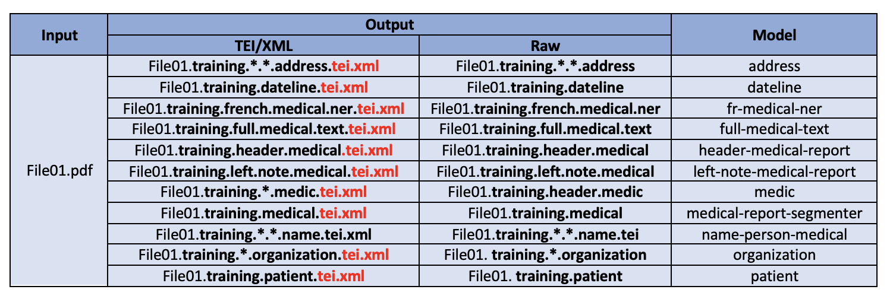
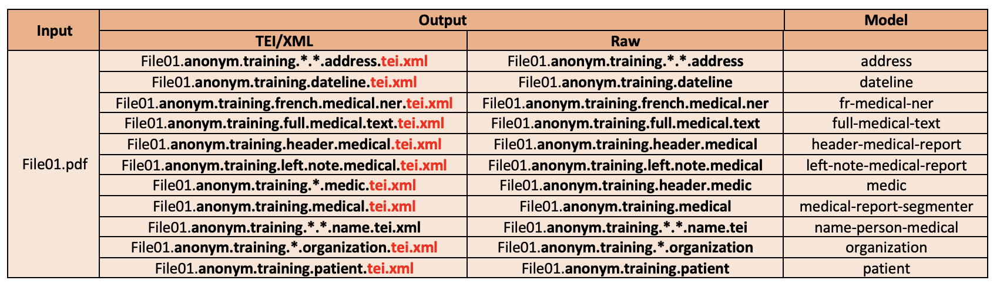
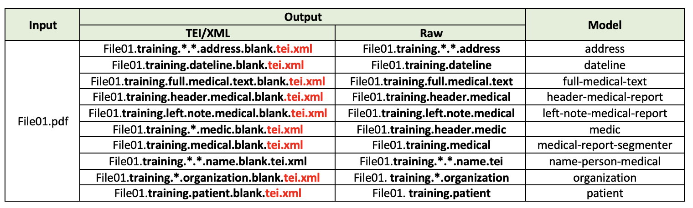

<h1>Training and evaluating grobid-medical-report models</h1>

We have 11 models placed under `grobid/grobid-home/models` to extract and to parse medical documents (PDF formats) and re-structure the information in TEI/XML format. The models are built in a modular manner with a cascade approach so that they are able to extract documents at different hierarchical levels.

- [x] medical-report-segmenter

- [x] header-medical-report

- [x] left-note-medical-report

- [x] full-medical-text

- [x] address

- [x] dateline

- [x] organization

- [x] medic

- [x] patient

- [x] name/person-medical (medics and patients' names)

- [x] fr-medical-ner (the French medical terminology recognition)

Each of these models can be retrained by using additional data. The following subsections explain the commands to train and to evaluate the models. 

## Train and evaluate
The train data is placed under `grobid/grobid-trainer/resources/dataset/[MODEL]/corpus`. [MODEL] is the corresponding model name. 

### Train
To train and to generate a new model, under the project directory `grobid/grobid-medical-report`, run the following command:

```bash
$ ./gradlew <training-goal-name>
```
Training goal names are: 
- `train_medical_report_segmenter`
- `train_header_medical_report`
- `train_left_note_medical_report`
- `train_full_medical_text`
- `train_address`
- `train_dateline`
- `train_organization`
- `train_medic`
- `train_patient`
- `train_name_person_medical`
- `train_french_medical_ner`

An example of a command for training the __medical-report-segmenter__ model:
```bash
$ ./gradlew train_medical_report_segmenter
```

As explain in [GROBID](https://grobid.readthedocs.io/en/latest/Training-the-models-of-Grobid/#train-and-evaluation-separately), we can control the training process (e.g., process speed) by using different parameters. To speed up the process, we can increase the `grobid.nb_thread` in the file `grobid-home/config/grobid.properties`. We can also modify the stopping criteria. For more information, please refer [this issue](https://github.com/kermitt2/grobid/issues/336#issuecomment-412516422).

### Evaluate
The test data is placed under `grobid/grobid-trainer/resources/dataset/[MODEL]/evaluation`. [MODEL] is the corresponding model name.
To evaluate the model, under the project directory `grobid/grobid-medical-report/` execute the following command:
```bash
$ ./gradlew <evaluation-goal-name>
```

Evaluation goal names are: 
- `eval_medical_report_segmenter`
- `eval_header_medical_report`
- `eval_left_note_medical_report`
- `eval_full_medical_text`
- `eval_address`
- `eval_dateline`
- `eval_organization`
- `eval_medic`
- `eval_patient`
- `eval_name_person_medical`
- `eval_french_medical_ner`

### Automatic data split, train and evaluate
We can split the datasets manually or automatically. With the manual way, the chosen train and test sets are located in the respective train and test folders manually as explained in the previous sections. Meanwhile, with the automatic way, the entire datasets are put under  `grobid/grobid-trainer/resources/dataset/*MODEL*/corpus/`. By default, the split portion is set into 80. However, the portion can be changed by updating the parameter `-s` in the `build.gradle` file. For example, `-s 0.9` is the train:test split portion of 90:10.

After preparing the datasets and set the split portion, to train and evaluate automatically, we run the following command:

```bash
$ ./gradlew <automatic-split-train-evaluation-goal-name>
```

Automatic split, train and evaluation goal names are: 
- `train_medical_report_segmenter_split`
- `train_header_medical_report_split`
- `train_left_note_medical_report_split`
- `train_full_medical_text_split`
- `train_address_split`
- `train_dateline_split`
- `train_organization_split`
- `train_medic_split`
- `train_patient_split`
- `train_name_person_medical_split`
- `train_french_medical_ner_split`

## Generate new datasets
With Pdf files as input, we can generate new datasets using pre-trained models.


For each input Pdf file and for each model, __grobid-medical-report__ generates two types of files:
- TEI/XML files (with `*.tei.xml` extensions) contain extracted and labeled text. Class definitions (for labels or tags) as well as annotation rules are different for each model.
- Raw files (without `*.tei.xml` extensions) contain extracted and tokenized text with their corresponding features. The features used are also different for each model.

The labeled files (`*.tei.xml`) can then be edited by human annotators to get new train or test data. However the files containing features should be left untouched.

There are three possibilities for generating new data:
- Extraction of original data with labels
- Extraction of pseudo data with labels
- Extraction of original data without labels

### Generate original data with labels 
For the provided PDF files, this batch command will generate training data for all **grobid-medical-report** models. 

```bash
$  java -Xmx4G -jar build/libs/grobid-medical-report-0.0.1-onejar.jar -gH ../grobid-home -dIn [~/path_to_input_directory/] -dOut [~/path_to_output_directory] -exe createTraining
```

This command requires the definition of input (`-dIn` parameter) and output (`-dOut` parameter) directories. The input directory refers to the directory containing the input PDF files. The output directory refers to the directory where the extracted files are stored.

Suppose we want to generate new training data from the Pdf file `File01.pdf`. By using this command, **grobid-medical-report** will call the pre-trained models and will generate two types of files for each model. The types of extracted files can be seen in the following table:



The file in column `[Input]` is the input PDF file. The files in column `[TEI/XML]` are files containing the extracted text with labels according to each model in column `[Model]`. The files in column `[Raw]` are files containing features for each token of the extracted text for each model in column `[Model]`.  

### Generate pseudo data with labels
What distinguishes this procedure from the previous one is that in this section, we want to anonymize sensitive data. Sensitive data can be found in labeled files as well as in files containing features, and thus we need to anonymize them.

For each input PDF file, there are two steps to anonymize data:
1. Create a reference file containing the data we want to anonymize and their corresponding changes. This reference file is very useful for human anontators for not losing the track track between the original data in the input file and the anonymized ones.
2. Generate pseudo data.

Both steps are performed automatically with the following commands.

#### 1. Generate reference files for pseudo data
For the provided PDF files, this command will generate reference files for data pseudonymization.

```bash
$  java -Xmx4G -jar build/libs/grobid-medical-report-0.0.1-onejar.jar -gH ../grobid-home -dIn [~/path_to_input_directory/] -dOut [~/path_to_output_directory] -exe createDataAnonymized
```

This command requires the definition of input (`-dIn` parameter) and output (`-dOut` parameter) directories. The input directory refers to the directory containing the input PDF files. The output directory refers to the directory where the reference files are stored.

#### 2. Generate pseudo data
For the provided PDF files, this batch command will generate pseudo data for all **grobid-medical-report** models.

```bash
$  java -Xmx4G -jar build/libs/grobid-medical-report-0.0.1-onejar.jar -gH ../grobid-home -dIn [~/path_to_input_directory/] -dOut [~/path_to_output_directory] -exe createTrainingAnonym
```

This command requires the definition of input (`-dIn` parameter) and output (`-dOut` parameter) directories. The input directory refers to the directory containing the input PDF files. The output directory refers to the directory where the extracted pseudo data are stored.

Suppose we want to generate new training data from the Pdf file `File01.pdf`. By using this command, **grobid-medical-report** will call the pre-trained models and will generate two types of files for each model. The types of extracted files can be seen in the following table:



The file in column `[Input]` is the input PDF file. The files in column `[TEI/XML]` are files containing the extracted pseudo data with labels according to each model in column `[Model]`. The files in column `[Raw]` are files containing features for each token of the extracted pseudo data for each model in column `[Model]`.

Anonymized data includes:
1. medical personnel data: names, addresses (personal addresses), emails
2. patient data: social security numbers, names, addresses, phone numbers, emails, dates of birth
3. document data: document numbers

| Element                | Original data       | Anonymized data     | 
|------------------------|---------------------|---------------------| 
| Security Social Number | 0123456789          | 5042697120          | 
| Phone Number           | 0760512430          | 0971642056          | 
| Birth date             | 2015-05-20          | 2022-02-17          | 
| Firstname              | Beau                | Belle               |  
| Lastname               | GARCON              | FILLE               | 
| Email                  | beau.garcon@aphp.fr | belle.fille@aphp.fr |
| Address                | 44000 NANTES        | 38000 GRENOBLE              |


### Generate blank data
This procedure will also generate new training data for all **grobid-medical-report** models. What distinguishes this procedure from the previous ones is that the TEI/XML files contain unlabeled texts. This procedure is useful if we want to build models from scratch.

For the provided PDF files, this batch command will generate blank training data for all **grobid-medical-report** models.

```bash
$  java -Xmx4G -jar build/libs/grobid-medical-report-0.0.1-onejar.jar -gH ../grobid-home -dIn [~/path_to_input_directory/] -dOut [~/path_to_output_directory] -exe createTrainingBlank
```

This command requires the definition of input (`-dIn` parameter) and output (`-dOut` parameter) directories. The input directory refers to the directory containing the input PDF files. The output directory refers to the directory where the extracted data are stored.

Suppose we want to generate new training data from the Pdf file `File01.pdf`. By using this command, **grobid-medical-report** will call the pre-trained models and will generate two types of files for each model. The types of extracted files can be seen in the following table:




## Annotation guidelines
After generating the new data, the next step before we can use them as train and test datasets is to correct the pre-annotated data (`*.tei.xml`). Guidance on how to correct pre-annotated data can be found here [Annotation guidelines](training/Annotation_guidelines.md).
