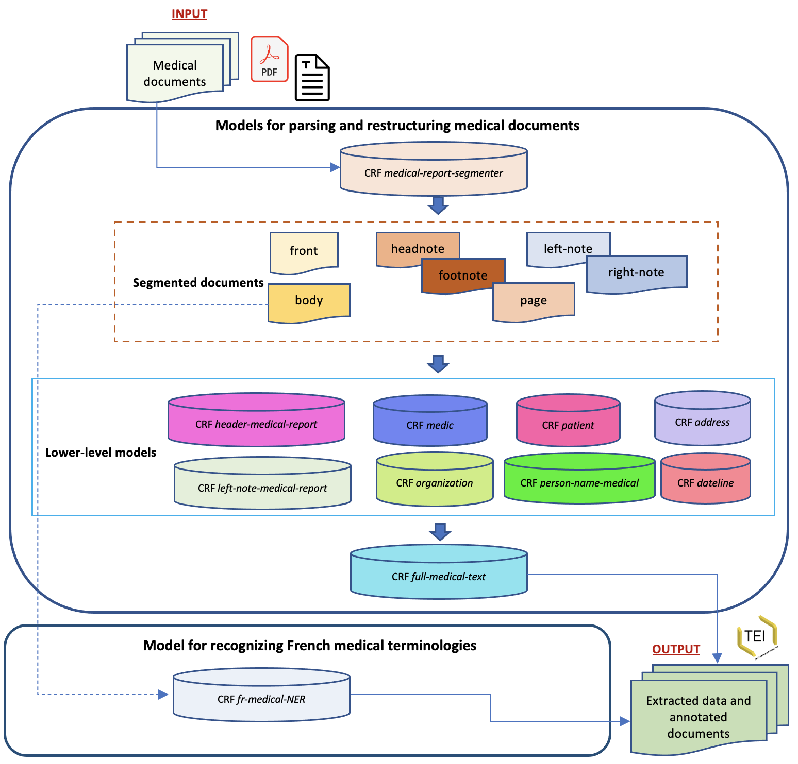

<h1>Training and evaluating grobid-medical-report models</h1>

## Models

As in Grobid, __grobid-medical-report__ also uses different sequence labeling models. For more complex extraction and parsing tasks, it uses several models in cascade.



The models prepared are:

- [x] medical-report-segmenter

- [x] header-medical-report

- [x] left-note-medical-report

- [x] full-medical-text

- [x] French medical terminology recognition 

- [x] dateline

- [x] organization

- [x] medic

- [x] patient

- [x] address

- [x] person-name (medics, patients)

Note:
- [x] (A completed model)
- [ ] (An uncompleted model - work in progress)

The models are placed under `grobid/grobid-home/models`. Each of these models can be re-trained using additional training data. For production, a model is trained with all available training data to maximize performance. For development purposes, it is possible to evaluate a model with part of the training data.

## Train and evaluate

For the __grobid-medical-report__ models, the training data is located under `grobid/grobid-medical-report/resources/dataset/*MODEL*/corpus/` where *MODEL* is the name of the model (e.g., `grobid/grobid-medical-report/resources/dataset/medical-report-segmenter/corpus`).

TEI files can be divided (e.g., 80%-20%) into training and evaluation datasets in the following ways: 

- manually: we choose and put the annotated datasets in two folders separately.
  
    The training data is present under `grobid/grobid-trainer/resources/dataset/*MODEL*/corpus/` while the evaluation data is present under  `grobid/grobid-trainer/resources/dataset/*MODEL*/evaluation/`.


- automatically: we put the the datasets under `grobid/grobid-trainer/resources/dataset/*MODEL*/corpus` and let grobid-medical-report choose and split them randomly as a given ratio (e.g., 0.8 for 80%). The first part of the data is the training data, while the second is the evaluation data.

Regardless of the method chosen (i.e., manual or automatic), the built model is placed under `grobid/grobid-home/models/*MODEL*/model.wapiti`. The newly built model will automatically replace the previous one. It is possible to rollback the process by replacing the current generated model with the backup record (`<model name>.wapiti.old`).

### Train
The considered training dataset is under `grobid/grobid-medical-report/resources/dataset/*MODEL*/corpus`.
To train and to generate a new model, under the project directory `grobid/grobid-medical-report` run the following command:

```bash
> ./gradlew <training-goal-name>
```
Training goal names are: `train_medical_report_segmenter`, `train_header_medical_report`, `train_left_note_medical_report`, `train_full_medical_text`, `train_dateline`, `train_organization`, `train_medic`, `train_patient`.

An example of a command for training the __medical-report-segmenter__ model:
```bash
> ./gradlew train_medical_report_segmenter
```

An example of a command for training the __header-medical-report__ model: 
```bash
> ./gradlew train_header_medical_report
```

An example of a command for training the __left-note-medical-report__ model: 
```bash
> ./gradlew train_left_note_medical_report
```

An example of a command for training the __train_full_medical_text__ model:
```bash
> ./gradlew train_full_medical_text
```

An example of a command for training the __train_dateline__ model:
```bash
> ./gradlew train_dateline
```

An example of a command for training the __train_dateline__ model:
```bash
> ./gradlew train_organization
```

An example of a command for training the __french_medical_ner__ model:
```bash
> ./gradlew train_french_medical_ner
```

Notes of errors :
- warning: missing tokens, cannot apply pattern
  - Solution:  check if every line in a training data has the expected number of features (also compared to the CRFPP template)

As explain in [GROBID](https://grobid.readthedocs.io/en/latest/Training-the-models-of-Grobid/#train-and-evaluation-separately), we can control the training process (e.g., process speed) by using different parameters. To speed up the process, we can increase the `grobid.nb_thread` in the file `grobid-home/config/grobid.properties`. Further, to increase the speed, we can also modify the stopping criteria. For more information, please refer [this comment](https://github.com/kermitt2/grobid/issues/336#issuecomment-412516422).

### Evaluate
The considered evaluation dataset is under `grobid/grobid-trainer/resources/dataset/*MODEL*/evaluation`
To evaluate the model, under the project directory `grobid/grobid-medical-report/` execute the following command:
```bash
> ./gradlew <evaluation-goal-name>
```

Evaluation goal names are: `eval_medical_report_segmenter`, `eval_header_medical_report`, `eval_left_note_medical_report`, `eval_full_medical_text`.

#### Automatically split data, train and evaluate
To split (e.g., training:evaluation = 80:20) automatically and randomly the dataset under `resources/dataset/*MODEL*/corpus/` into training and evaluation datasets, execute the following command:

```bash
> ./gradlew <automatic-evaluation-goal-name>
```

Automatic train goal names are: `train_medical_report_segmenter_split`, `train_header_medical_report_split`, `train_left_note_medical_report_split`, `train_full_medical_text`, `train_french_medical_ner_split`

By default, the training and evaluation data partition is 80:20 (i.e., the datasets are under `grobid/grobid-trainer/resources/dataset/*MODEL*/corpus`). To change it, add the `-s` parameter or change the `-s` `build.gradle` to the desired proportion.

## Generation of training data
For each input Pdf file, __grobid-medical-report__ generates XML files according to the models adopted since each model uses different training data (e.g., *.training.medical.tei.xml, *.training.header.medical.tei.xml, *.training.left.note.medical.tei.xml). To use these automatically-generated XML files as a gold standard,  we need first to check and correct them.

When the models use PDF layout features, __grobid-medical-report__ generates additional feature files (e.g., *.training.medical, *.training.header.medical, *.training.left.note.medical).

To generate a new training data, under the project directory `grobid/grobid-medical-report/` execute the following command:

```bash
> java -Xmx4G -jar build/libs/grobid-medical-report-0.0.1-onejar.jar -gH grobid-home -dIn ~/path_to_input_directory/ -dOut ~/path_to_output_directory -exe <generation-of-training-data-command>
```

Generation of training data commands are: `createTrainingBlank`, `createTraining`, `createTrainingBlankFrenchMedicalNER`, `createTrainingFrenchMedicalNER` .

Particularly for the `createTrainingBlank` and `createTrainingBlankFrenchMedicalNER`, these commands are used for generating datasets without labels. In general, they are used for building new models from scratch.
.

<!---
An example of a command for generating a new training data for the __medical-report-segmenter__ model: 
```bash
> java -Xmx4G -jar build/libs/grobid-medical-report-0.0.1-onejar.jar -gH grobid-home -dIn ~/path_to_input_directory/ -dOut ~/path_to_output_directory -exe createTrainingSegmentationBlank
```

An example of a command for generating a new training data for the __medical-report-segmenter__ model: 
```bash
> java -Xmx4G -jar build/libs/grobid-medical-report-0.0.1-onejar.jar -gH grobid-home -dIn ~/path_to_input_directory/ -dOut ~/path_to_output_directory -exe createTrainingSegmentation
```

An example of a command for generating a new training data for the __header-medical-report__ model: 
```bash
> java -Xmx4G -jar build/libs/grobid-medical-report-0.0.1-onejar.jar -gH grobid-home -dIn ~/path_to_input_directory/ -dOut ~/path_to_output_directory -exe createTrainingHeaderBlank
```

An example of a command for generating a new training data for the __header-medical-report__ model: 
```bash
> java -Xmx4G -jar build/libs/grobid-medical-report-0.0.1-onejar.jar -gH grobid-home -dIn ~/path_to_input_directory/ -dOut ~/path_to_output_directory -exe createTrainingHeader
```

An example of a command for generating a new training data for the __left-note-medical-report__ model:
```bash
> java -Xmx4G -jar build/libs/grobid-medical-report-0.0.1-onejar.jar -gH grobid-home -dIn ~/path_to_input_directory/ -dOut ~/path_to_output_directory -exe createTrainingLeftNote
```
--->

An example of a command for generating blank training data for all models (including the segmentation model):   
```bash
> java -Xmx4G -jar build/libs/grobid-medical-report-0.0.1-onejar.jar -gH grobid-home -dIn ~/path_to_input_directory/ -dOut ~/path_to_output_directory -exe createTrainingFullBlank
```

An example of a command for generating pre-annotated training data for all models (including the segmentation model):
```bash
> java -Xmx4G -jar build/libs/grobid-medical-report-0.0.1-onejar.jar -gH grobid-home -dIn ~/path_to_input_directory/ -dOut ~/path_to_output_directory -exe createTrainingFull
```

With this command, for each PDF file as input, for each model, two types of files will be generated. They are files containing features (without *.xml extension) and files containing pre-annotated data using existing trained models (e.g., medical-report-segmenter model, header-medical-report model). 
These files can then be corrected and be used for re-training new models. Only pre-annotated TEI files can be revised while the feature files cannot be corrected manually.

Depending on what model we want to retrain, these files will then need to be placed under grobid-trainer directory (`grobid-trainer/resources/dataset/*MODEL*/`), especially under `grobid-trainer/resources/dataset/*MODEL*/corpus` for training data and under `grobid-trainer/resources/dataset/*MODEL*/evaluation` for evaluation data. The corrected TEI files need to be put under `grobid-trainer/resources/dataset/*MODEL*/corpus/tei` and the feature files under `grobid-trainer/resources/dataset/*MODEL*/corpus/raw`.

An example of a command for generating a new training data for the __fr-medical-NER__ model:
```bash
> java -Xmx4G -jar build/libs/grobid-medical-report-0.0.1-onejar.jar -gH grobid-home -dIn ~/path_to_input_directory/ -dOut ~/path_to_output_directory -exe createMedicalNerTraining
```

## Training guidelines
Annotation guidelines for creating the training data corresponding to the different GROBID models are available from the [following page](training/General-principles.md).

## Data Anonymization 
With the awareness that we work with confidential data, we also provide facilities to anonymize sensitive data.
There are two types of anonymized data:
- data to conduct training and testing activities for all levels of the models;
- final results for end-user

The data that we anonymize includes the social security numbers, the names, the phone numbers, the address, and the dates of birth of patients, names of doctors and health practitioners, document numbers.

### Data Anonymization for Training and Testing Datasets
To anonymize the sensitive data in datasets and to assist annotators in referencing the anonymized data to the original data, two steps are required:
1. Extracting reference data containing original data and anonymized data.

```bash
> java -Xmx4G -jar build/libs/grobid-medical-report-0.0.1-onejar.jar -gH ../grobid-home -dIn ~/path_to_input_directory_containing_PDF/ -dOut  ~/path_to_output_directory_containing_result_TXT/ -exe createDataAnonymized
```
The input path is the path where PDF files containing the data to be extracted are saved. The output results are in TXT format. 
The resulting file format is as follows:

| Element | Original data      | Anonymized data | 
| ------- |--------------------| --------------- | 
| Security Social Number | 0123456789         | 5042697120 | 
| Phone Number | 0760512430         | 0971642056 | 
| Birth date | 2015-05-20         | 2022-02-17 | 
| Firstname | Beau               | Belle  |  
| Lastname | GARCON             | FILLE | 
| Email | beau.garcon@aphp.fr | belle.fille@aphp.fr |


2. Extracting dataset with anonymized data based on reference data.

```bash
> java -Xmx4G -jar build/libs/grobid-medical-report-0.0.1-onejar.jar -gH ../grobid-home -dIn ~/path_to_input_directory_containing_PDFs/ -dOut  ~/path_to_output_directory_containing_results/ -exe createTrainingAnonym
```
The input path is the path where PDF files containing the data to be extracted are saved.
As training files used in Grobid family projects, for each PDF file as input and for each model, two types of files will be generated. 
- files containing features (without *.xml extension) 
- files containing pre-annotated data using existing trained models

The difference with ordinary training data generation is that with this method, sensitive data are anonymized.
