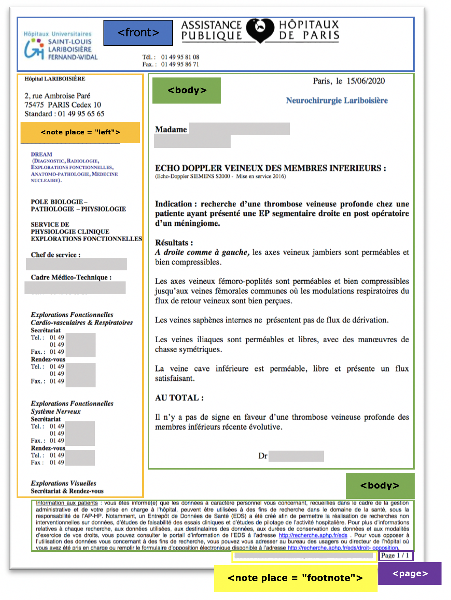
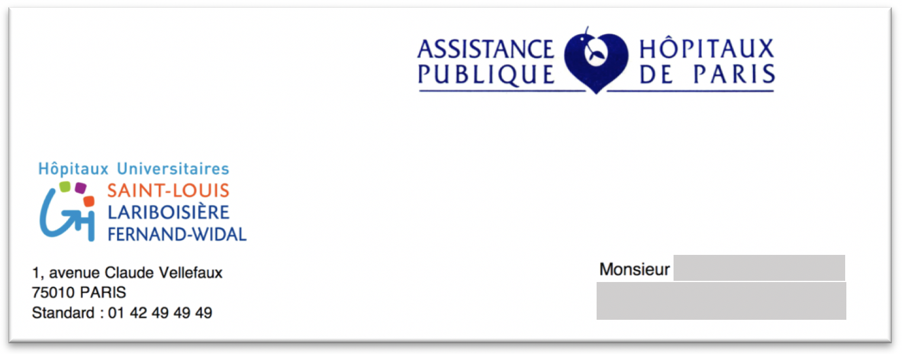
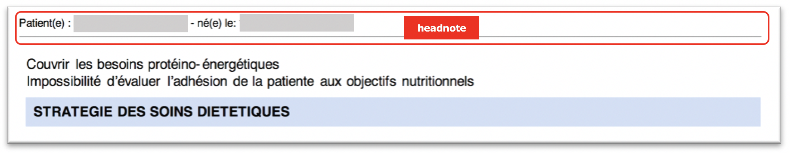
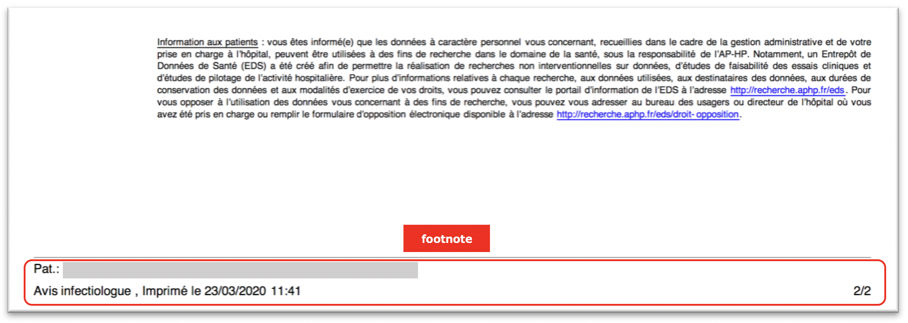
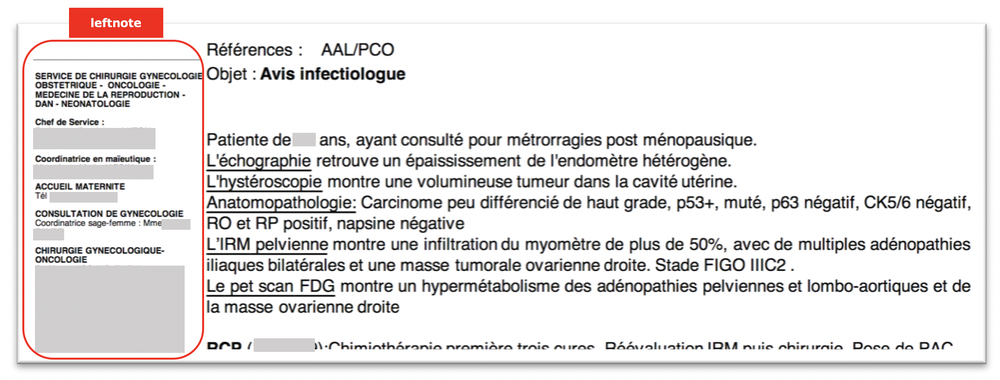

# Annotation guidelines for the _medical-report-segmenter_ model

## Introduction

For the following guidelines, we first need to generate the training data as explained [here](../Training-the-medical-report-models.md#generation-of-training-data).

For the medical report segmentation model, we use the following TEI elements:

* `<front>` for document header
* `<note place="headnote">` for the page header note
* `<note place="footnote">` for the page footer note
* `<note place="left">` for the notes on the document left section
* `<note place="right">` for the notes on the document right section
* `<body>` for the document body
* `<page>` for the page numbers
* `<div type="acknowledgment">` for the acknowledgment
* `<other>` for unknown (yet) part

Figures and tables (including their potential titles, captions, and notes) are considered part of the body, so contained by the `<body>` element.
Note that the mark-up follows overall the [TEI](http://www.tei-c.org). 

> Note: It is recommended to study first the existing training documents for the __medical-report-segmenter__ model (`grobid/grobid-medical-report/resources/dataset/medical-report-segmenter`) to see some examples of how these elements should be used.



## Analysis

The following sections provide detailed information and examples on how to handle certain typical cases.

### Header of the document (front)

The header section typically contains document information (i.e., document number, title, and type, dates, medics with their affiliations, patients, and complete correspondence with telephone, fax, e-mail, and web information). All this material should be contained within the `<front>` element. In general, we expect as part of the header of the document to find information about the type of the document, the date and the time, the owner of the document, and if it's possible, the actors (e.g., medics, patients) at an early stage before proceeding to the contents of the document.



There should be as many `<front>` elements as necessary that contain all the contents identified as 'front contents'. Note that for the segmentation model, there aren't any `<title>`, `<medic>` or `<patient>` elements, as they are handled in the cascaded `header-medical-report` model, applied in the next stage.

Any footnotes referenced from within the `<body>` should remain there.

> Note: In general, whether the `<lb/>` (line break) element is inside or outside the `<front>` or other elements is of no importance. However as indicated [here](General-principles.md#correcting-pre-annotated-files), the <lb/> element should not be removed and should follow the stream of text. 

### Page header (headnote)

Any information appearing in the page header needs to be surrounded by a `<note place="headnote">`.



Corresponding TEI XML:

```xml
<note place="headnote">Patient(e) : XXX YYY ZZZ -né(e) le: 00/00/0000 <lb/></note>

```

### Page footer (footnote)

Any information appearing in the page footer needs to be put inside a `<note place="footnote">`, as is shown in the following example:



Corresponding TEI XML:

```xml
<note place="footnote">Pat.: XXX YYY ZZZ | F/M | 00/00/0000 | 0123456789 | 123456789 <lb/>Avis infectiologue , Imprimé le 23/03/2020 11:41 <lb/></note>

```

### Page 

The `<page>` element which contains the page number should be outside of any of the above `<note>` elements.

### Leftnote 

Any notes to the left of the main body text are to be encoded as `<note place="left">`, as is shown in the following example:


